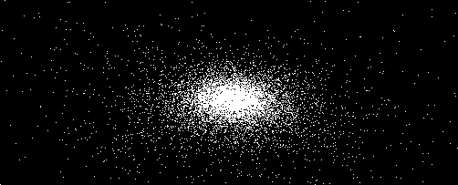

# NBodyCLGL
NBody Boost.Compute Example using Qt5 and QOpenGLWindow

## Dependency
- cmake >= 3.1.0
- Qt >= 5.4
- Boost >= 1.61.0
- OpenCL SDK
- OpenGL

## Notes

Currently only tested with Qt MinGW Compiler on Windows. Unfortunately not working on MSVC Compiler on my machine.

## Demo

